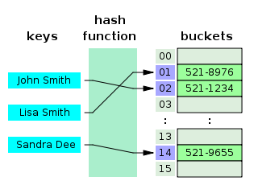
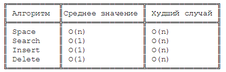

#### Реализация структуры hashtable (add, has, get, delete, clear)

Хэш-таблицы



*Так работают хэш-таблица и хэш-функция*

Хэш-таблица — это похожая на Map структура, которая содержит пары ключ/значение. Она использует хэш-функцию для вычисления индекса в массиве из блоков данных, чтобы найти желаемое значение.

Обычно хэш-функция принимает строку символов в качестве вводных данных и выводит числовое значение. Для одного и того же ввода хэш-функция должна возвращать одинаковое число. Если два разных ввода хэшируются с одним и тем же итогом, возникает коллизия. Цель в том, чтобы таких случаев было как можно меньше.  

Таким образом, когда вы вводите пару ключ/значение в хэш-таблицу, ключ проходит через хэш-функцию и превращается в число. В дальнейшем это число используется как фактический ключ, который соответствует определенному значению. Когда вы снова введёте тот же ключ, хэш-функция обработает его и вернет такой же числовой результат. Затем этот результат будет использован для поиска связанного значения. Такой подход заметно сокращает среднее время поиска.  

## Временная сложность хэш-таблицы



```JS
/* Hash Table */

var hash = (string, max) => {
  var hash = 0;
  for (var i = 0; i < string.length; i++) {
    hash += string.charCodeAt(i);
  }
  return hash % max;
};

let HashTable = function() {

  let storage = [];
  const storageLimit = 14;
  
  this.print = function() {
    console.log(storage)
  }

  this.add = function(key, value) {
    const index = hash(key, storageLimit);
    if (storage[index] === undefined) {
      storage[index] = [
        [key, value]
      ];
    } else {
      const inserted = false;
      for (let i = 0; i < storage[index].length; i++) {
        if (storage[index][i][0] === key) {
          storage[index][i][1] = value;
          inserted = true;
        }
      }
      if (inserted === false) {
        storage[index].push([key, value]);
      }
    }
  };

  this.remove = function(key) {
    const index = hash(key, storageLimit);
    if (storage[index].length === 1 && storage[index][0][0] === key) {
      delete storage[index];
    } else {
      for (let i = 0; i < storage[index].length; i++) {
        if (storage[index][i][0] === key) {
          delete storage[index][i];
        }
      }
    }
  };

  this.lookup = function(key) {
    const index = hash(key, storageLimit);
    if (storage[index] === undefined) {
      return undefined;
    } else {
      for (let i = 0; i < storage[index].length; i++) {
        if (storage[index][i][0] === key) {
          return storage[index][i][1];
        }
      }
    }
  };

};


console.log(hash('quincy', 10))

let ht = new HashTable();
ht.add('beau', 'person');
ht.add('fido', 'dog');
ht.add('rex', 'dinosour');
ht.add('tux', 'penguin')
console.log(ht.lookup('tux'))
ht.print();
```

## Преимущества
1. Основным преимуществом хэш-таблиц перед другими структурами табличных данных является скорость. Это преимущество более очевидно, когда количество записей велико. Хэш-таблицы особенно эффективны, когда максимальное количество записей может быть заранее спрогнозировано, так что массив корзин (buckets) может быть выделен один раз с оптимальным размером и никогда не изменяться в размере.

2. Если набор пар ключ-значение фиксирован и известен заранее (поэтому вставки и удаления не допускаются), можно уменьшить среднюю стоимость поиска путем тщательного выбора хэш-функции, размера таблицы сегментов и внутренних структур данных. В частности, можно разработать хэш-функцию, которая не будет иметь коллизий или даже будет совершенной. В этом случае ключи не должны храниться в таблице.

## Недостатки

1. Хотя операции с хэш-таблицей в среднем занимают постоянное время, стоимость хорошей хэш-функции может быть значительно выше, чем внутренний цикл алгоритма поиска для последовательного списка или дерева поиска. Таким образом, хэш-таблицы не эффективны, когда количество записей очень мало. (Однако в некоторых случаях высокая стоимость вычисления хэш-функции может быть уменьшена путем сохранения значения хэш-функции вместе с ключом.)

2. Для некоторых приложений обработки строк, таких как проверка орфографии, хэш-таблицы могут быть менее эффективными, чем попытки, конечные автоматы или массивы Джуди. Кроме того, если не слишком много возможных ключей для хранения, то есть если каждый ключ может быть представлен достаточно малым количеством битов, то вместо хэш-таблицы можно использовать ключ непосредственно в качестве индекса в массиве значений. Обратите внимание, что в этом случае нет коллизий.

3. Записи, хранящиеся в хэш-таблице, могут быть эффективно перечислены (с постоянной стоимостью за запись), но только в некотором псевдослучайном порядке. Следовательно, не существует эффективного способа найти запись, ключ которой ближе всего к данному ключу. Для перечисления всех n записей в определенном порядке обычно требуется отдельный шаг сортировки, стоимость которого пропорциональна log(n) для каждой записи. Для сравнения, упорядоченные деревья поиска имеют стоимость поиска и вставки, пропорциональную log(n), но позволяют находить ближайший ключ примерно с той же стоимостью, и упорядоченное перечисление всех записей с постоянными затратами на запись.

4. Если ключи не сохранены (поскольку хэш-функция не содержит коллизий), может быть нелегко перечислить ключи, которые присутствуют в таблице в любой данный момент.

5. Хотя средняя стоимость операции постоянна и довольно мала, стоимость одной операции может быть довольно высокой. В частности, если в хэш-таблице используется динамическое изменение размера, операция вставки или удаления может иногда занимать время, пропорциональное количеству записей. Это может быть серьезным недостатком в реальном времени или для интерактивных приложений.

6. Хэш-таблицы в целом демонстрируют плохую привязку, т.е. данные, к которым осуществляется доступ, по-видимому, случайным образом распределяются в памяти. Поскольку хэш-таблицы вызывают скачкообразное изменение шаблонов доступа, это может вызвать пропуски в кеше микропроцессора, которые вызывают длительные задержки. Компактные структуры данных, такие как массивы осуществляющие линейный поиск, могут быть быстрее, если таблица относительно мала, а ключи компактны. Оптимальная точка производительности варьируется от системы к системе.

7. Хэш-таблицы становятся довольно неэффективными, когда существует много коллизий. В то время как крайне неравномерное распределение хэша крайне маловероятно, случайный злоумышленник со знанием хэш-функции может предоставить информацию хэшу, который создает поведение в худшем случае, вызывая чрезмерные коллизии, что приводит к очень низкой производительности, например, атака отказа в обслуживании. В критических приложениях может использоваться структура данных с лучшими гарантиями наихудшего случая; однако универсальное хэширование - рандомизированный алгоритм, который не позволяет злоумышленнику предсказать, какие входные данные вызывают поведение в наихудшем случае - может быть предпочтительным. Хэш-функция, используемая хэш-таблицей в кэше таблицы маршрутизации Linux, была изменена в Linux версии 2.4.2 в качестве меры противодействия таким атакам.

