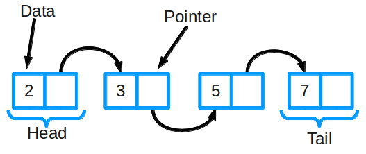
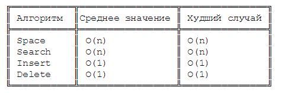

#### Реализация структуры list (add, has, get, delete, clear)

Связные списки


Связный список — одна из базовых структур данных. Ее часто сравнивают с массивом, так как многие другие структуры можно реализовать с помощью либо массива, либо связного списка. У этих двух типов есть преимущества и недостатки.



*Так устроен связный список*

Связный список состоит из группы узлов, которые вместе образуют последовательность. Каждый узел содержит две вещи: фактические данные, которые в нем хранятся (это могут быть данные любого типа) и указатель (или ссылку) на следующий узел в последовательности. Также существуют двусвязные списки: в них у каждого узла есть указатель и на следующий, и на предыдущий элемент в списке.

Основные операции в связном списке включают добавление, удаление и поиск элемента в списке.

Временная сложность связного списка



```JS
/* LinkedList */

function LinkedList() { 
  var length = 0; 
  var head = null; 

  var Node = function(element){
    this.element = element; 
    this.next = null; 
  }; 

  this.size = function(){
    return length;
  };

  this.head = function(){
    return head;
  };

  this.add = function(element){
    var node = new Node(element);
    if(head === null){
        head = node;
    } else {
        var currentNode = head;

        while(currentNode.next){
            currentNode  = currentNode.next;
        }

        currentNode.next = node;
    }

    length++;
  }; 

  this.remove = function(element){
    var currentNode = head;
    var previousNode;
    if(currentNode.element === element){
        head = currentNode.next;
    } else {
        while(currentNode.element !== element) {
            previousNode = currentNode;
            currentNode = currentNode.next;
        }

        previousNode.next = currentNode.next;
    }

    length --;
  };
  
  this.isEmpty = function() {
    return length === 0;
  };

  this.indexOf = function(element) {
    var currentNode = head;
    var index = -1;

    while(currentNode){
        index++;
        if(currentNode.element === element){
            return index;
        }
        currentNode = currentNode.next;
    }

    return -1;
  };

  this.elementAt = function(index) {
    var currentNode = head;
    var count = 0;
    while (count < index){
        count ++;
        currentNode = currentNode.next
    }
    return currentNode.element;
  };
  
  
  this.addAt = function(index, element){
    var node = new Node(element);

    var currentNode = head;
    var previousNode;
    var currentIndex = 0;

    if(index > length){
        return false;
    }

    if(index === 0){
        node.next = currentNode;
        head = node;
    } else {
        while(currentIndex < index){
            currentIndex++;
            previousNode = currentNode;
            currentNode = currentNode.next;
        }
        node.next = currentNode;
        previousNode.next = node;
    }
    length++;
  }
  
  this.removeAt = function(index) {
    var currentNode = head;
    var previousNode;
    var currentIndex = 0;
    if (index < 0 || index >= length){
        return null
    }
    if(index === 0){
        head = currentNode.next;
    } else {
        while(currentIndex < index) {
            currentIndex ++;
            previousNode = currentNode;
            currentNode = currentNode.next;
        }
        previousNode.next = currentNode.next
    }
    length--;
    return currentNode.element;
  }

} 

var conga = new LinkedList();
conga.add('Kitten');
conga.add('Puppy');
conga.add('Dog');
conga.add('Cat');
conga.add('Fish');
console.log(conga.size());
console.log(conga.removeAt(3));
console.log(conga.elementAt(3));
console.log(conga.indexOf('Puppy'));
console.log(conga.size());
```


## Преимущества

* эффективное (за константное время) добавление и удаление элементов
* размер ограничен только объёмом памяти компьютера и разрядностью указателей
* динамическое добавление и удаление элементов

## Недостатки

Недостатки связных списков вытекают из их главного свойства — последовательного доступа к данным:

* сложность прямого доступа к элементу, а именно определения физического адреса по его индексу (порядковому номеру) в списке
* на поля-указатели (указатели на следующий и предыдущий элемент) расходуется дополнительная память (в массивах, например, указатели не нужны)
* некоторые операции со списками медленнее, чем с массивами, так как к произвольному элементу списка можно обратиться, только пройдя все предшествующие ему элементы
* соседние элементы списка могут быть распределены в памяти нелокально, что снизит эффективность кэширования данных в процессоре
* над связными списками, по сравнению с массивами, гораздо труднее (хоть и возможно) производить параллельные векторные операции, такие, как вычисление суммы: накладные расходы на перебор элементов снижают эффективность распараллеливания