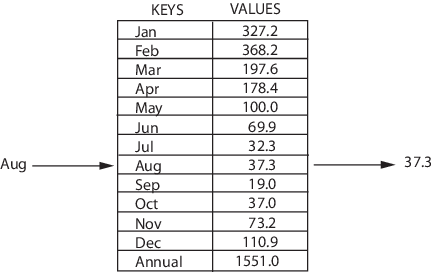

#### Реализация структуры map (add, has, get, delete, clear)

Map — это структура, которая хранит данные в парах ключ/значение, где каждый ключ уникален. Иногда её также называют ассоциативным массивом или словарём. Map часто используют для быстрого поиска данных. Она позволяет делать следующие вещи:

* добавлять пары в коллекцию;
* удалять пары из коллекции;
* изменять существующей пары;
* искать значение, связанное с определенным ключом.



Так устроена структура map

```JS
/* Maps */

let myMap = function() {
	this.collection = {};
	this.count = 0;
	this.size = function() {
		return this.count;
	};
	this.set = function(key, value) {
		this.collection[key] = value;
		this.count++;
	};
	this.has = function(key) {
		return (key in this.collection);
	};
	this.get = function(key) {
		return (key in this.collection) ? this.collection[key] : null;
	};
	this.delete = function(key) {
		if (key in this.collection) {
			delete this.collection[key];
			this.count--;
		}
	};
	this.values = function() {
		let result = new Array();
		for (let key of Object.keys(this.collection)) {
			result.push(this.collection[key]);
		};
		return (result.length > 0) ? result : null;
	};
	this.clear = function() {
		this.collection = {};
		this.count = 0;
	};
};

let map = new myMap();
map.set('arms', 2);
map.set('fingers', 10);
map.set('eyes', 2);
map.set('belley button', 1);

console.log(map.get('fingers'));
console.log(map.size());
console.log(map.values());

let map2 = new Map();
map2.has('hands');
map2.entries();

let keyObj = {},
    keyFunc = function() {};

map2.set('hello', 'string value');
map2.set(keyObj, 'obj value');
map2.set(keyFunc, 'func value');
map2.set(NaN, 'NaN value')

console.log(map2.size);

console.log(map2.get('hello'));
console.log(map2.get(keyObj));
console.log(map2.get(keyFunc));
console.log(map2.get(NaN));
```

Существует множество различных реализаций ассоциативного массива.

Самая простая реализация может быть основана на обычном массиве, элементами которого являются пары (ключ, значение). Для ускорения операции поиска можно упорядочить элементы этого массива по ключу и осуществлять нахождение методом бинарного поиска. Но это увеличит время выполнения операции добавления новой пары, так как необходимо будет «раздвигать» элементы массива, чтобы в образовавшуюся пустую ячейку поместить новую запись.

Наиболее популярны реализации, основанные на различных деревьях поиска. Так, например, в стандартной библиотеке STL языка С++ контейнер map реализован на основе красно-чёрного дерева. В языках Ruby, Tcl, Python используется один из вариантов хэш-таблицы. Есть и другие реализации.

У каждой реализации есть свои достоинства и недостатки. Важно, чтобы все три операции выполнялись как в среднем, так и в худшем случае за время O(\log n), где n — текущее количество хранимых пар. Для сбалансированных деревьев поиска (в том числе для красно-чёрных деревьев) это условие выполнено.

В реализациях, основанных на хэш-таблицах, среднее время оценивается как O(1), что лучше, чем в реализациях, основанных на деревьях поиска. Но при этом не гарантируется высокая скорость выполнения отдельной операции: время операции INSERT в худшем случае оценивается как O(n). Операция INSERT выполняется долго, когда коэффициент заполнения становится высоким и необходимо перестроить индекс хэш-таблицы.

Хэш-таблицы плохи также тем, что на их основе нельзя реализовать быстро работающие дополнительные операции MIN, MAX и алгоритм обхода всех хранимых пар в порядке возрастания или убывания ключей.