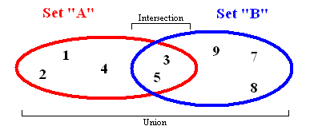

#### Реализация структуры set (add, has, delete, clear)



Так выглядит множество

Множество хранит значения данных без определенного порядка, не повторяя их. Оно позволяет не только добавлять и удалять элементы: есть ещё несколько важных функций, которые можно применять к двум множествам сразу.

* Объединение комбинирует все элементы из двух разных множеств, превращая их в одно (без дубликатов).  
* Пересечение анализирует два множества и  создает еще одно из тех элементов, которые присутствуют в обоих изначальных множествах.
* Разность выводит список элементов, которые есть в одном множестве, но отсутствуют в другом.
* Подмножество выдает булево значение, которое показывает, включает ли одно множество все элементы другого множества.

```JS
/* Sets */

function mySet() {
    // the var collection will hold the set
    var collection = [];
    // this method will check for the presence of an element and return true or false
    this.has = function(element) {
        return (collection.indexOf(element) !== -1);
    };
    // this method will return all the values in the set
    this.values = function() {
        return collection;
    };
    // this method will add an element to the set
    this.add = function(element) {
        if(!this.has(element)){
            collection.push(element);
            return true;
        }
        return false;
    };
    // this method will remove an element from a set
    this.remove = function(element) {
        if(this.has(element)){
            index = collection.indexOf(element);
            collection.splice(index,1);
            return true;
        }
        return false;
    };
    // this method will return the size of the collection
    this.size = function() {
        return collection.length;
    };
    // this method will return the union of two sets
    this.union = function(otherSet) {
        var unionSet = new mySet();
        var firstSet = this.values();
        var secondSet = otherSet.values();
        firstSet.forEach(function(e){
            unionSet.add(e);
        });
        secondSet.forEach(function(e){
            unionSet.add(e);
        });
        return unionSet;
    };
    // this method will return the intersection of two sets as a new set
    this.intersection = function(otherSet) {
        var intersectionSet = new mySet();
        var firstSet = this.values();
        firstSet.forEach(function(e){
            if(otherSet.has(e)){
                intersectionSet.add(e);
            }
        });
        return intersectionSet;
    };
    // this method will return the difference of two sets as a new set
    this.difference = function(otherSet) {
        var differenceSet = new mySet();
        var firstSet = this.values();
        firstSet.forEach(function(e){
            if(!otherSet.has(e)){
                differenceSet.add(e);
            }
        });
        return differenceSet;
    };
    // this method will test if the set is a subset of a different set
    this.subset = function(otherSet) {
        var firstSet = this.values();
        return firstSet.every(function(value) {
          return otherSet.has(value);
        });
    };
}
var setA = new mySet();  
var setB = new mySet();  
setA.add("a");  
setB.add("b");  
setB.add("c");  
setB.add("a");  
setB.add("d");  
console.log(setA.subset(setB));
console.log(setA.intersection(setB).values());
console.log(setB.difference(setA).values());

var setC = new Set();  
var setD = new Set();  
setC.add("a");  
setD.add("b");  
setD.add("c");  
setD.add("a");  
setD.add("d");  
console.log(setD.values())
setD.delete("a");
console.log(setD.has("a"));
console.log(setD.add("d"));
```