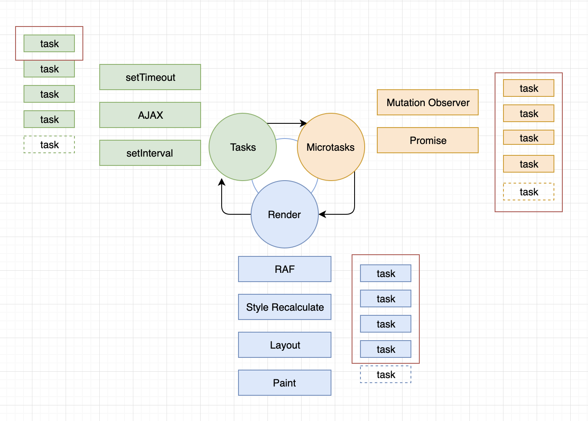
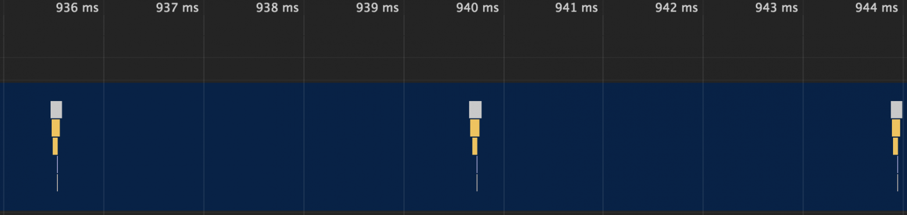

**EventLoop нарисовать схему работы в подробностях**

Код каждой HTML-страницы в браузере выполняется в Main Thread. Main Thread — это основной поток, где браузер выполняет JS, делает перерисовки, обрабатывает пользовательские действия и многое другое. По сути, это то место, где движок JS интегрирован в браузер.

Проще всего разобраться, глядя на схему:


Мы видим, что единственное место, через которое задачи могут попасть в Call Stack и выполниться — это Event Loop. Представьте, что вы оказались на его месте. И ваша работа успевать 'разгребать' задачи. Задачи могут быть двух типов:

Личные — выполнение основного JavaScript-кода на сайте (далее будем считать, что он уже выполнился)
Задачи от заказчиков — Render, Microtasks и Tasks

Скорее всего, личные задачи у вас будут приоритетнее. Event Loop с этим согласен :) Остается упорядочить задачи от заказчика.

Конечно, первое, что приходит в голову — задать каждому заказчику приоритет, и выстроить их в очередь. Второе — определить, как именно будут обрабатываться задачи от каждого заказчика — по одной, все сразу или, может быть, пачками.

Взглянем на эту схему:



На основе этой схемы строится вся работа Event Loop.
После того как мы начали выполнять какой-либо script, в очередь Tasks ставится задача с выполнением этого скрипта. По мере выполнения этого кода, нам встречаются задачи от разных заказчиков, которые ставятся в соответствующие очереди. После того как завершается задача по выполнению скрипта (задача от Tasks), Event Loop идет к Microtasks (после задачи от Tasks Event Loop берет задачи от Microtasks). У него Event Loop берет задачи до тех пор, пока они не закончатся. Это значит, что если время их добавления равно времени их выполнения, то Event Loop будет бесконечно их разгребать.
Далее он идет к Render и выполняет задачи от него. Задачи от Render оптимизируются браузером и, если он посчитает, что в этом цикле не нужно ничего перерисовывать, то Event Loop просто пойдет дальше. Далее Event Loop снова берет задачи от Tasks и просит у него только одну, первую в очереди задачу, передает ее в CallStack и идет дальше по циклу.

Если у кого-то из заказчиков не оказалось задач, то Event Loop просто идет к следующему. И, наоборот, если у заказчика задачи занимают много времени, то остальные заказчики будут ждать своей очереди. А если задачи от какого-то заказчика оказались бесконечными, то Call Stack переполняется, и браузер начинает ругаться:

Теперь, когда мы поняли как работает Event Loop, пришло время разобраться, что будет после выполнения фрагментов кода в начале этой статьи.

```javaScript
function foo() {
  setTimeout(foo, 0);
}

foo();
```

Мы видим, что функция foo вызывает сама себя рекурсивно через setTimeout внутри, но при каждом вызове она создает задачу заказчика Tasks. Как мы помним, в цикле Event Loop при выполнении очереди задач от Tasks берет только 1 задачу в цикл. И далее происходит выполнение задач от Microtasks и Render. Поэтому этот фрагмент кода не заставит Event Loop страдать и вечно разгребать его задачи. Но будет подкидывать новую задачу для заказчика Tasks на каждом круге.

Давайте попробуем выполнить этот скрипт в браузере Google Chrome. Для этого я создал простой HTML-документ и подключил в нем script.js с этим фрагментом кода. После открытия документа заходим в инструменты разработчика, и открываем вкладку Perfomance и жмем там кнопку 'start profiling and reload page':



Видим, что задачи от Tasks выполняются по одной в цикл, примерно раз в 4ms.

Рассмотрим вторую задачку:

```javaScript
function foo() {
  Promise.resolve().then(foo);
}

foo();
```

Здесь мы видим тоже самое, что и в примере выше, но вызов foo добавляет задачи от Microtasks, а они выполняются все, пока не закончатся. А это значит, что пока Event Loop не закончит их, перейти к следующему заказчику он не сможет :( И мы видим снова грустную картинку.

Мы видим, что микротаски выполняются примерно раз в 0.1ms, и это в 40 раз быстрее, чем очередь Tasks. Все потому, что они выполняются все и сразу. В нашем примере очередь движется бесконечно.

**Я бы немного переформулировал это предложение. Event Loop берет не все микротаски сразу, а приступает к выполнению задач из стека микротасок и не успокаивается до тех пор, пока не опустошит стек и только после этого переходит к Render.